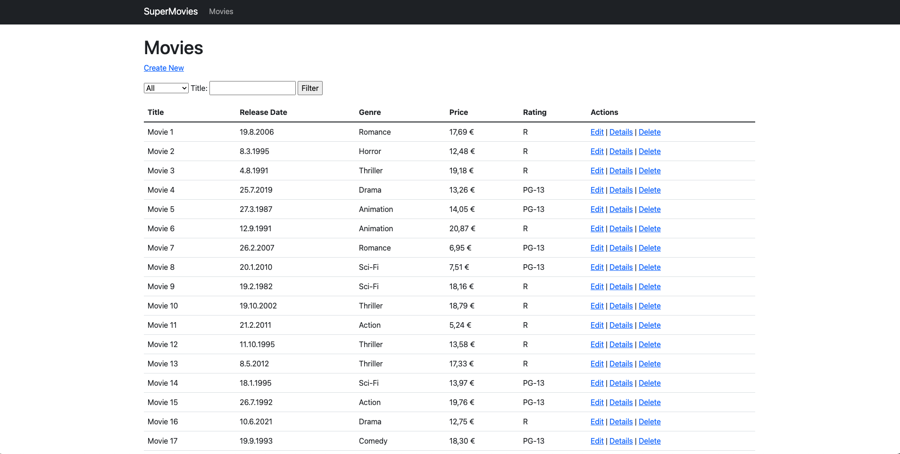

# SuperMovies

SuperMovies is an ASP.NET Core MVC application designed to help users manage their favorite movies. The application provides features for adding, editing, viewing, and deleting movie records, along with filtering options by genre or title.

## Features

- **Movie Management**: Add, edit, view, and delete movies.
- **Genre Filtering**: Easily filter movies by genre.
- **Search Functionality**: Search movies by title.
- **Responsive Design**: The application is styled using Bootstrap for a modern and responsive UI.
- **Database Integration**: Data is stored and managed using an SQL Server database.

## Technologies Used

- **ASP.NET Core MVC**: For building the web application.
- **Entity Framework Core**: For database management and access.
- **Bootstrap**: For responsive and user-friendly design.
- **SQL Server**: For data storage.

- ## Screenshot

Below is a preview of the application:



## Installation

1. Clone the repository:
   ```bash
   git clone 
   ```
2. Navigate to the project directory:
   ```bash
   cd SuperMovies
   ```
3. Restore NuGet packages:
   ```bash
   dotnet restore
   ```
4. Apply database migrations:
   ```bash
   dotnet ef database update
   ```
5. Run the application:
   ```bash
   dotnet run
   ```
6. Open your browser and go to `http://localhost:5000` to use the application.

## Usage

1. Navigate to the **Movies** page.
2. Use the "Create New" button to add a new movie.
3. Filter movies by genre or search by title using the form on the Movies page.
4. Edit or delete movie records as needed.

## Folder Structure

```
MvcMovie/
├── Controllers/
│   ├── MoviesController.cs
├── Models/
│   ├── Movie.cs
│   ├── MovieGenreViewModel.cs
├── Views/
│   ├── Movies/
│   │   ├── Index.cshtml
│   │   ├── Create.cshtml
│   │   ├── Edit.cshtml
├── wwwroot/
│   ├── images/
│   │   ├── movie1.png
│   ├── css/
│   │   ├── site.css
├── Program.cs
├── README.md
```

## License

This project is licensed under the MIT License. See the LICENSE file for more details.

## Contributing

Feel free to fork this repository, make changes, and submit pull requests. Contributions are always welcome!
